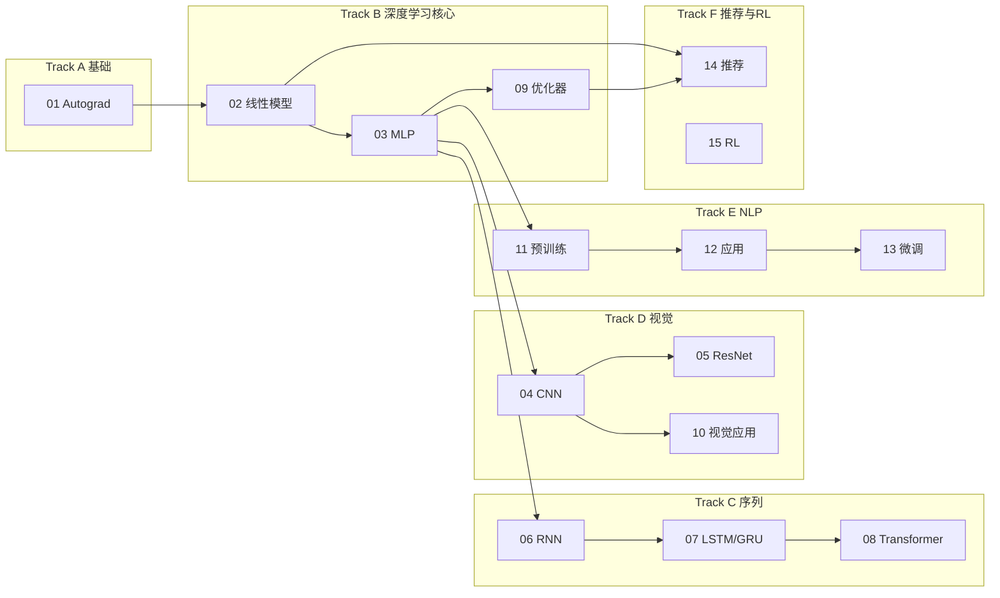

# DeepPath Lab 入门指南

这份文档面向**个人系统学习**：从零配置环境，到按模块推进、自检掌握程度。建议先读完本文，再打开 [learning-guide.md](learning-guide.md) 查各模块运行命令。

## 这是什么

DeepPath Lab 不是教材镜像，而是一套**项目制深度学习学习仓库**：

- 每个模块 = 一个小项目（笔记 + 从零实现 + 复现 + 实验 + 报告）
- 代码刻意保持小而可读，注释解释「为什么这样写」
- 15 个模块覆盖：自动微分 → 线性/MLP/CNN → 序列与 Transformer → 优化与视觉应用 → NLP 预训练/应用/微调 → 推荐与强化学习

## 环境准备

```bash
git clone <your-repo-url>
cd DeepPathLab
python3 -m venv .venv
source .venv/bin/activate          # Windows: .venv\Scripts\activate
pip install -r requirements.txt
```

要求：Python 3.10+，约 2GB 磁盘（含 PyTorch 与 Fashion-MNIST 缓存）。

## 第一次使用（约 5 分钟）

```bash
# 1. 确认 15 个模块都能跑通
python3 scripts/verify_all.py

# 2. 跑通第一个核心实验
python3 modules/01_preliminaries_autograd/experiments/gradient_check.py

# 3. 跑单元测试（可选，验证核心实现）
python3 scripts/run_tests.py
```

看到 `15/15 passed` 和梯度检查 `PASS`，说明环境就绪。

## 学习路线图



### 推荐学习顺序

| 阶段 | 模块 | 目标 |
|------|------|------|
| 1 地基 | 01 | 理解计算图与链式法则 |
| 2 经典监督 | 02–03, 09 | 线性模型、MLP、优化器 |
| 3 视觉 | 04–05, 10 | 卷积、残差、迁移学习 |
| 4 序列 | 06–08 | RNN → 门控 → 注意力 |
| 5 NLP | 11–13 | 词向量 → 分类 → 微调 |
| 6 扩展 | 14–15 | 矩阵分解、Q-learning |

**并行提示**：模块 09（优化器）可在学完 03 后随时插入；模块 14 可与 NLP 阶段并行。

## 单模块标准流程

每个模块目录结构一致，按下面顺序走完一遍，就算「学完」该模块：

```text
1. 读 README.md     — 本模块学什么、跑什么命令
2. 读 notes.md      — 概念、公式、踩坑、自检问题
3. 读 from_scratch/ — 对照代码理解核心机制（先读再跑）
4. 运行 from_scratch 主脚本 — 看输出是否符合 notes 预期
5. 运行 reproduce/  — 与框架基线对比
6. 运行 experiments/ — 做对照实验，观察「为什么」
7. 读 report.md     — 回顾结论与推荐复习命令
8. 回答 notes 里的自检问题（能口述或手算）
```

### 模块目录说明

| 目录/文件 | 作用 |
|-----------|------|
| `notes.md` | 你的概念笔记（仓库内已写好初稿，可在此基础上增补） |
| `from_scratch/` | 手写核心算法，**学习重点** |
| `reproduce/` | PyTorch 等框架复现，用于对照 |
| `experiments/` | 消融、可视化、诊断 |
| `report.md` | 实验结论、知识点回顾、复习命令 |

## 如何验证「真的学会了」

不要只看代码能跑。每个模块至少做到：

1. **能解释**：用一句话说清本模块解决什么问题
2. **能手推**：关键公式能在纸上推一步（如链式法则、Q-learning 更新式）
3. **能改代码**：做小改动后预测结果变化（如调学习率、改 ε-greedy）
4. **能对照**：说出 from_scratch 与 reproduce 的差异和各自用途

仓库提供两层自动检查：

```bash
python3 scripts/verify_all.py   # 各模块主脚本 smoke test
python3 scripts/run_tests.py      # 核心实现的单元测试
```

进度清单见 [study-checklist.md](study-checklist.md)，可勾选记录。

## 快捷命令

```bash
# 只跑某一个模块
python3 scripts/run_module.py 08

# 只验证部分模块
python3 scripts/verify_all.py --only 11 12 13

# 查看模块索引
cat modules/README.md
```

## 常见问题

**Q: Fashion-MNIST 下载慢或失败？**  
A: 首次运行 CNN 相关脚本会下载到 `data/`。可配置镜像或手动放置数据集后重试。

**Q: 模块 import 报错？**  
A: 请在**仓库根目录**运行命令，路径以 `modules/xx_.../` 开头。各脚本内部已处理 `sys.path`。

**Q: verify 某个模块超时？**  
A: 模块 13 微调实验较慢（约 1–2 分钟）。单独重跑：`python3 modules/13_nlp_fine_tuning/experiments/freeze_vs_finetune.py`。

**Q: 和 D2L / CS231n 的关系？**  
A: 外部教材是**阅读参考**；本仓库只存原创笔记与代码。章节对应见 [d2l-mapping.md](d2l-mapping.md)。

## 延伸阅读

- [learning-guide.md](learning-guide.md) — 15 模块命令速查表
- [study-checklist.md](study-checklist.md) — 学习进度勾选清单
- [d2l-mapping.md](d2l-mapping.md) — 与 D2L 章节映射
- [learning-sources.md](learning-sources.md) — 推荐外部资源
- [../lib/README.md](../lib/README.md) — 共享工具库
